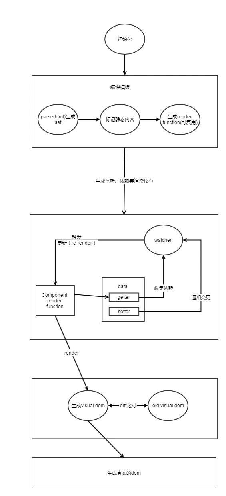
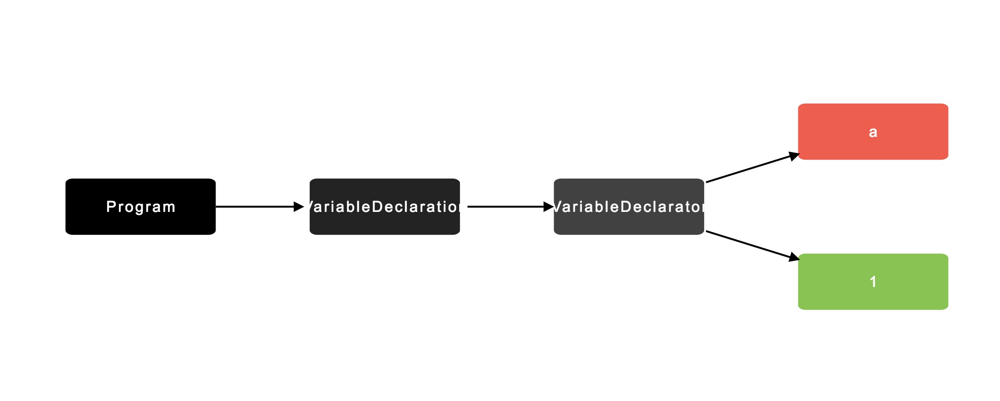

# cue
###MVVM框架

Core 核心组件 获取当前模块子模块，销毁实例

Core *\_\_proto\_\_* 指向 Module

Module *\_\_proto\_\_* 指向 Root

```javascript
var app = Sugar.core.create('app', App)
```
*App* 实例使用 *Core \_\_proto\_\_*的  *Module* 上的 *create* 方法创建根节点，方法体内调用 *new App*
*App* 中通过传入*App* 中的基础配置 如 *model* 数据，*methods* 方法等等后 通过 *this.super('init', config)* 来调用父类 *Component* 中的 *init* 来进行进一步的配置
之后再在 *init* 方法中 *new MVVM* 来进行*Compile* 和 *parse* 等底层解析操作

###Component

[Object与Function](https://www.kancloud.cn/kancloud/javascript-prototype-closure/66341)

### Learning

项目中的感悟与学习过程：

1. [前端模板的演变以及Vue原理](https://github.com/dxil/cue/tree/master/doc/前端模板的演变.md)
2. [设计模式](https://github.com/dxil/cue/tree/master/doc/设计模式.md)
3. [观察者模式](https://github.com/dxil/cue/tree/master/doc/观察者模式.md)


### 前端模板的演变

### 1、 直接操作dom

页面的构建，总是离不开对dom的直接操作

```javascript
var div = document.createElement('div')
var p = document.createElement('p')
p.innerText = 'Hello World'
div.appendChild(p)
document.body.appendChild(div)
```

缺点：

1. 频繁对dom进行访问/操作，性能变差
2. 每次的更改比较麻烦

### 2、Micro-Templating

为了解决这种麻烦的操作方式，jQuery的作者 [John Resig] 写了一个小型的[Micro-Templating](https://johnresig.com/blog/javascript-micro-templating/)

模板的使用语法:

```html
<script type="text/html" id="item_templ">
	<div id="<%=id%>" class="<%=(i % 2 == 1 ? " even" : "")%>">
      <div class="grid_1 alpha right">
        "/>
      </div>
      <div class="grid_6 omega contents">
        <p><b><a href="/<%=from_user%>"><%=from_user%></a>:</b> <%=text%></p>
      </div>
    </div>  
</script>
```

#### 2.1 Micro Template 实现代码

```javascript
// Simple JavaScript Templating

// John Resig - https://johnresig.com/ - MIT Licensed

(function(){

  var cache = {};

   

  this.tmpl = function tmpl(str, data){

    // Figure out if we're getting a template, or if we need to

    // load the template - and be sure to cache the result.

    var fn = !/\W/.test(str) ?

      cache[str] = cache[str] ||

        tmpl(document.getElementById(str).innerHTML) :

       

      // Generate a reusable function that will serve as a template

      // generator (and which will be cached).

      new Function("obj",

        "var p=[],print=function(){p.push.apply(p,arguments);};" +

         

        // Introduce the data as local variables using with(){}

        "with(obj){p.push('" +

         

        // Convert the template into pure JavaScript

        str

          .replace(/[\r\t\n]/g, " ")

          .split("<%").join("\t")

          .replace(/((^|%>)\t*)'/g, "$1\r")

          .replace(/\t=(.*?)%>/g, "',$1,'")

          .split("\t").join("');")

          .split("%>").join("p.push('")

          .split("\r").join("\'")

      + "');}return p.join('');");

     

    // Provide some basic currying to the user

    return data ? fn( data ) : fn;

  };

})();
```


##### 2.2.1 主要知识点：

1. [new Function](https://developer.mozilla.org/zh-CN/docs/Web/JavaScript/Reference/Global_Objects/Function): 用于创建一个将模板解析成html字符串并且结合 *data* 的函数  *fn*，通过  *fn(data)*  传入模板中用到的全局 *data*。


1. [with](https://developer.mozilla.org/zh-CN/docs/Web/JavaScript/Reference/Statements/with): 传入的 *data* 作为函数体中 *obj* 的变量取值，也可声明一个临时变量来存值，达到一样的效果。


1. 正则表达式对字符串进行切割 如识别到模板语法中的 *<%* 替换成 *\t*

##### 2.2.2 存在的问题：

1. 代码调试痛苦，不方便定位问题

2. 无法将数据与状态绑定，每次数据的更改需要更新整个视图层

   ​

### 3. Vue的模板实现学习

> Vue的使用非常的简单，根据官方文档可以快速的入门，但是本着不能只知道如何使用，而不知道是如何起作用的原则，了解一下Vue的实现机制

#### 3.1 Vue核心执行过程图



或者说：

.jpg)


#### 3.2 vue源码分析

分析目录结构：通过Vue的package.json文件中的"rollup -w -c scripts/config.js --environment TARGET:web-full-dev"可以得知目录打包入口为 "scripts/config.js" ，一层层找之后获得Vue实例在 'instance/index.js'下创建

```javascript
function Vue (options) {
  if (process.env.NODE_ENV !== 'production' &&
    !(this instanceof Vue)
  ) {
    warn('Vue is a constructor and should be called with the `new` keyword')
  }
  this._init(options)
}
```

我们创建Vue实例一开始传入的options (el, data, methods)等等属性都通过参数传入了this._init(options)中，我们接着往下看 _init()函数做了什么事情：

首先是创建了uid为每个实例创建唯一id，之后通过mergeOptions()把vm上的options和基础设置的options合并（具体功能不讨论，是个用的比较多的Utils函数），接下来进入核心主题：

```javascript
	initLifecycle(vm)  // 创建初始生命周期
    initEvents(vm)	// 不看。。
    initRender(vm)	// vnode 创建虚拟dom与词法分析 AST
    callHook(vm, 'beforeCreate') // 没看
    initInjections(vm) // resolve injections before data/props
    initState(vm)	// 主菜，数据劫持，创建Depend与Watcher
    initProvide(vm) // resolve provide after data/props
    callHook(vm, 'created')
```


#### 3.3 InitState

initState是我着重分析的部分，因为涉及到双向绑定的核心实现和mvvm中的vm。

我们先看看代码：

```javascript
export function initState (vm: Component) {
  vm._watchers = []
  const opts = vm.$options
  if (opts.props) initProps(vm, opts.props) 
  if (opts.methods) initMethods(vm, opts.methods) // 将methods合并入vm上
  if (opts.data) {
    initData(vm)
  } else {
    observe(vm._data = {}, true /* asRootData */) // 对每个数据绑定劫持属性。
  }
  if (opts.computed) initComputed(vm, opts.computed)
  if (opts.watch && opts.watch !== nativeWatch) {
    initWatch(vm, opts.watch)
  }
}
```

**3.3.1 observe**

observe函数一开始对数据是否是数组和Object进行了检验，然后创建了一个Observer实例

```javascript
export class Observer {
  value: any;
  dep: Dep;
  vmCount: number; // number of vms that has this object as root $data

  constructor (value: any) {
    this.value = value // 
    this.dep = new Dep()
    this.vmCount = 0
    def(value, '__ob__', this)
    if (Array.isArray(value)) {
      const augment = hasProto
        ? protoAugment
        : copyAugment
      augment(value, arrayMethods, arrayKeys)
      this.observeArray(value)
    } else {
      this.walk(value)
    }
  }

  /**
   * Walk through each property and convert them into
   * getter/setters. This method should only be called when
   * value type is Object.
   */
  walk (obj: Object) {
    const keys = Object.keys(obj)
    for (let i = 0; i < keys.length; i++) {
      defineReactive(obj, keys[i], obj[keys[i]])
    }
  }

  /**
   * Observe a list of Array items.
   */
  observeArray (items: Array<any>) {
    for (let i = 0, l = items.length; i < l; i++) {
      observe(items[i])
    }
  }
}
```

在数据劫持前，对数据的array和object进行了递归监听属性，最主要是传入了walk函数，之后调用了defineReactive函数，进行每个属性的监听。

**3.3.2 defineReactive**

defineReactive在每个数据一开始创建了一个事件的依赖者Depend()，为了让页面中使用的数据监听依赖，之后通过Object.definePropty方法，对getter，setter处理，在getter调用时判断当前调用时是否传入了depend.target（节点编译时取数据是否调用了当前的getter，如果调用了，则可认为是有一个watcher（事件观察者）观察了这个依赖）接着就可以调用dep.depend()方法来为依赖添加一个订阅者。在setter设置值阶段，如果有数据变化，则调用notify()来将Depend中的所有subs(watchers)调用自己的update方法进行更新页面元素，可能有些枯燥，看看代码：

```javascript
export function defineReactive (
  obj: Object,
  key: string,
  val: any,
  customSetter?: ?Function,
  shallow?: boolean
) {
  const dep = new Dep() // 首先创建一个数据依赖者

  const property = Object.getOwnPropertyDescriptor(obj, key)
  if (property && property.configurable === false) {
    return
  }

  // cater for pre-defined getter/setters
  const getter = property && property.get
  const setter = property && property.set

  let childOb = !shallow && observe(val)
  Object.defineProperty(obj, key, {
    enumerable: true,
    configurable: true,
    get: function reactiveGetter () {
      const value = getter ? getter.call(obj) : val
      // Dep.target 调用数据时，是否来自观察者的调用，如果是，则可认为依赖了这个依赖者
      if (Dep.target) {
        dep.depend() // 通过之后的watcher.addDep()推入dep的subs数组中
        if (childOb) { 
          childOb.dep.depend()
          if (Array.isArray(value)) {
            dependArray(value)
          }
        }
      }
      return value
    },
    set: function reactiveSetter (newVal) {
      const value = getter ? getter.call(obj) : val
      /* eslint-disable no-self-compare */
      if (newVal === value || (newVal !== newVal && value !== value)) {
        return
      }
      /* eslint-enable no-self-compare */
      if (process.env.NODE_ENV !== 'production' && customSetter) {
        customSetter()
      }
      if (setter) {
        setter.call(obj, newVal)
      } else {
        val = newVal
      }
      childOb = !shallow && observe(newVal) 
      dep.notify() // 通知所有的观察者，依赖发生改变
    }
  })
}
```


接着数据劫持属性方法，我们趁热看看数据的观察者和订阅者的实现


**3.3.3 Vue中的依赖者Dep**

```javascript
export default class Dep {
  static target: ?Watcher;
  id: number;
  subs: Array<Watcher>;

  constructor () {
    this.id = uid++ // 每个dep的唯一id
    this.subs = [] // 用于装入所有的当前的订阅者
  }
  
  // 增加订阅者
  addSub (sub: Watcher) {
    this.subs.push(sub)
  }
	
  // 删除订阅者
  removeSub (sub: Watcher) {
    remove(this.subs, sub)
  }
	
  // 为监听依赖的观察者加入subs中
  depend () {
    if (Dep.target) {
      Dep.target.addDep(this)
    }
  }
	
  // 通知所有的观察者，已经发生了变更
  notify () {
    // stabilize the subscriber list first
    const subs = this.subs.slice()
    for (let i = 0, l = subs.length; i < l; i++) {
      subs[i].update()
    }
  }
}
```

如同我们上一篇说到的观察者模式一样，Dep()拥有增加观察者，删除观察者，通知观察者等等功能。


**3.3.4 Vue中的观察者Watcher**

```javascript
export default class Watcher {
  vm: Component;
  expression: string;
  cb: Function;
  
  constructor (
    vm: Component,
    expOrFn: string | Function,
    cb: Function,
    options?: ?Object,
    isRenderWatcher?: boolean
  ) {
    this.vm = vm
    if (isRenderWatcher) {
      vm._watcher = this
    }
    vm._watchers.push(this)
    // options
    if (options) {
      this.deep = !!options.deep
      this.user = !!options.user
      this.lazy = !!options.lazy
      this.sync = !!options.sync
    } else {
      this.deep = this.user = this.lazy = this.sync = false
    }
    this.cb = cb
    this.id = ++uid // uid for batching
    this.active = true
    this.dirty = this.lazy // for lazy watchers
    this.deps = []
    this.newDeps = []
    this.depIds = new Set()
    this.newDepIds = new Set()
    this.expression = process.env.NODE_ENV !== 'production'
      ? expOrFn.toString()
      : ''
    // parse expression for getter
    if (typeof expOrFn === 'function') {
      this.getter = expOrFn
    } else {
      this.getter = parsePath(expOrFn)
      if (!this.getter) {
        this.getter = function () {}
        process.env.NODE_ENV !== 'production' && warn(
          `Failed watching path: "${expOrFn}" ` +
          'Watcher only accepts simple dot-delimited paths. ' +
          'For full control, use a function instead.',
          vm
        )
      }
    }
    this.value = this.lazy
      ? undefined
      : this.get()
  }

  /**
   * Evaluate the getter, and re-collect dependencies.
   */
  get () {
    pushTarget(this)
    let value
    const vm = this.vm
    try {
      value = this.getter.call(vm, vm)
    } catch (e) {
      if (this.user) {
        handleError(e, vm, `getter for watcher "${this.expression}"`)
      } else {
        throw e
      }
    } finally {
      // "touch" every property so they are all tracked as
      // dependencies for deep watching
      if (this.deep) {
        traverse(value)
      }
      popTarget()
      this.cleanupDeps()
    }
    return value
  }

  /**
   * Add a dependency to this directive. 为watcher增加依赖
   */
  addDep (dep: Dep) {
    const id = dep.id
    if (!this.newDepIds.has(id)) {
      this.newDepIds.add(id)
      this.newDeps.push(dep)
      if (!this.depIds.has(id)) {
        dep.addSub(this)
      }
    }
  }

  /**
   * Clean up for dependency collection.
   */
  cleanupDeps () {
    let i = this.deps.length
    while (i--) {
      const dep = this.deps[i]
      if (!this.newDepIds.has(dep.id)) {
        dep.removeSub(this)
      }
    }
    let tmp = this.depIds
    this.depIds = this.newDepIds
    this.newDepIds = tmp
    this.newDepIds.clear()
    tmp = this.deps
    this.deps = this.newDeps
    this.newDeps = tmp
    this.newDeps.length = 0
  }

  /**
   * Subscriber interface.
   * Will be called when a dependency changes. 当事件变化，会推入队列执行自己的update更新函数，即	  * 传入时的cb函数。
   */
  update () {
    /* istanbul ignore else */
    if (this.lazy) {
      this.dirty = true
    } else if (this.sync) {
      this.run()
    } else {
      queueWatcher(this)
    }
  }

  /**
   * Depend on all deps collected by this watcher.
   */
  depend () {
    let i = this.deps.length
    while (i--) {
      this.deps[i].depend()
    }
  }
}
```

其中Watcher会在页面compile解析dom节点,parseHTML的时候传入 ``new Watcher(vm, updateComponent, noop, null, true /* isRenderWatcher */)`` 每次更新时都会去Update自身的组件。


#### 3.4 Vue中的Compile （AST，tokenize，Vdom）

在前面运行图时已经可以看出在拿到模板后首先要编译模板，生成  *AST* ( *Abstract Syntax Tree* ) 抽象对象树，即源代码的抽象语法树的结构的表示，并不会表示出具体的代码实现细节，也不依赖于源代码的语法，树上的每个节点映射出源代码中的一种结构

> **什么是抽象语法树**
> 抽象语法树(Abstract Syntax Tree) 是源代码语法结构的抽象表示，并以树这种数据结构进行描述。AST 属编译原理范畴，有比较成熟的理论基础，因此被广泛运用在对各种程序语言（JavaScript, C, Java, Python等等）的编译处理中。Vue 同样也是使用 AST 作为中间形式完成对 html 模板的编译。

在继续Vue编译节点原理前，需要先了解 *AST* 构建的一般过程

**3.1.1 AST 示例**

比如：

```javascript
let a = 1;
```

生成的 *AST* 格式如下:

```javascript
{
    type: "Program",
    body: [
        {
            type: "VariableDeclaration",
            declarations: [
                {
                    type: "VariableDeclarator",
                    id: {
                        type: "Identifier",
                        name: "a"
                    },
                    init: {
                        type: "Literal",
                        value: 1,
                        raw: "1"
                    }
                }
            ],
            kind: "let"
        }
    ],
    sourceType: "script"
}
```

*AST* 图形预览:



[在线生成 *AST* 结构工具](http://astexplorer.net/)                 [在线生成 *AST* 图形工具](http://resources.jointjs.com/demos/javascript-ast)


**3.1.2 Vue中AST的实现**

不说了，全是正则，我也不会。

# 设计模式

## 一、动态类型语言与静态类型语言

静态类型语言是指变量在程序编译时就已经确定好变量的类型，而动态类型语言则在程序运行时赋值后才知道变量的类型。

静态类型语言的优点与缺点

- 程序在编译阶段就能只能变量的类型，预期的输入是什么，保证代码类型出错导致的程序运行错误，提高代码运行的效率
- 使得代码必须按照一种约束执行，代码类型的检查是编写可靠性高的程序的一种手段，而不是编写程序的目的，让程序员的精力更多的从思考业务逻辑上分散开来

JS是一种动态类型语言，变量的类型在程序运行时可变，使得代码运行更灵活，可以调用对象的一切方法，这些概念都基于 **鸭子类型** （duck typing）概念上，通俗来讲，**如果它走起路来像鸭子，叫起来像鸭子，那么它就是鸭子。**

## 二、多态

多态是指，给多个对象发统一命令的时候，会得到不同的解释，和不同的结果，换一句话说，发出同一命令，会得到不同的反馈，举栗子：

> Jerry 让大家清理Jira 任务，Cuzz清理了AIMeeting，Lemon清理了公版任务，同样是清理任务，但是根据同一命令，不同的人清理的任务不同。

先看一段"多态"的代码

```javascript
function cleanJira (staff) {
  if (staff instanceof Cuzz) {
    console.log('AImeeting done')
  }else if (staff instanceof Lemon) {
    console.log('公版 done')
  }
}

function Cuzz = {}
function Lemon = {}
cleanJira (new Cuzz)
cleanJira (new Lemon)
```

这的确体现了多态性，但是显然这样的结果很不满意，如果之后又增加了其它员工需要清理任务，此时我们就得改动cleanJira函数，危险性不说，而且会导致cleanJira函数越来越庞大。

多态背后的思想是，"怎么做"与"谁去做，做什么"分离开来，把不变的部分隔离，可变的部分封装起来，程序看起来就会是可生长的，也符合开放-封闭原则。参考下面代码：

```javascript
class Cuzz {
  cleanJira () {
    console.log('AImeeting done')
  }
}

class Lemon {
  cleanJira () {
    console.log ('gongban done')
  }
}

function cleanJira (staff) {
  staff.cleanJira()
}

cleanJira(new Cuzz())
cleanJira(new Lemon())
```


## 三、类型检查与多态

先把上述例子转换成 Java 代码

```java
public class Cuzz {
  public void cleanJira () {
    System.out.println('AImeeting done');
  }
}

public class Lemon {
  public void cleanJira () {
    System.out.println('gongban done');
  }
}

public class StaffClean {
  public void cleanJira (Cuzz cuzz) {
    cuzz.cleanJira();
  }
}

public class Test {
  public static void main (String args[]) {
    StaffClean staffclean = new StaffClean();
    Cuzz cuzz = new Cuzz();
    StaffClean.cleanJira(cuzz)
  }
}
```

我们已经可以让Cuzz清理Jira任务了，但是你会发现 上面的代码，如果要让Lemon清理Jira任务是做不到的，因为StaffClean 只允许接收Cuzz类型，传入Lemon类型会直接报错，这时候我们要怎么实现让两个人都能清理任务，该怎么实现呢，这时候就要引入一个超类，静态语言通常设计为当给一个类变量赋值时，可以是这个类本身，也可以是这个类的超类，Cuzz清理任务，和Lemon清理任务，可以说成是他们各自本身在清理任务，也可以说是员工在清理任务。

```java
// 首先抽象出一个Staff员工
public abstract class Staff {
  abstract void cleanJira();
}

public class Cuzz extends Staff {
  public void cleanJira () {
    System.out.println("AImeeting done");
  }
}

public class Lemon extends Staff {
  public void cleanJira () {
    System.out.println("gongban done");
  }
}

public class StaffClean {
  public void cleanJira (Staff staff) {
    staff.cleanJira();
  }
}

public class Test {
  public static void main (String args[]) {
    StaffClean staffclean = new StaffClean();
    Staff cuzz = new Cuzz();
    Staff lemon = new Lemon();
    StaffClean.cleanJira(cuzz);
    StaffClean.cleanJira(lemon);
  }
}
```

一个Javascript对象，既可以是员工Cuzz，也可以是员工Lemon，这意味着Javascript本身就是具有多态性的

## 多态在面向对象中的作用

多态的好处在于把一大堆的条件分支语句转化为对象的多态性，从而消除条件分支语句

> 在公司，当Jerry说清理任务的时候，Cuzz知道清理AImeeting，Lemon清理公版任务等等，而不需要走到每个人的面前告诉需要清理什么任务，如果是程序，那么就需要一大堆的if else去判断，进来的是谁，需要做啥。


# 观察者模式

## 一、什么是观察者模式

观察者模式是一种设计模式，也叫做 发布/订阅模式 ，它定义对象中的一对多的依赖关系，当一个对象的状态发生变化，所有依赖它的对象都能得到通知。

先抛出个栗子：

> 办公室的网又断了，Jerry正在修复网，但是啥时候修好，Jerry也不知道，于是大家干等着，总有些人不老实，过一两分钟就喊："Jerry！！网好了没啊！"，"Jerry！！ 网咋还没来！"，没问多少次，Jerry就生气了，大喊："好了，我会告诉你们！"

这个栗子中，可以发现，观察者模式显而易见的优点。

- 大家不需要时时刻刻询问Jerry网好没好，Jerry作为发布者，会通知这些订阅者。
- Jerry和员工在更改网这件事上不存在强耦合关系，Jerry不用关心，到底是你Cuzz要用网，还是你Lemon要用网，只管自己先把网修好。而我们员工也不会关心，修网的到底是Jerry还是Jerry打电话移动，让移动上门修复网，只要Jerry记得修好了告诉大家就行。

在Javascript的世界里，应用场景也十分广泛，如Dom的 addEventListner事件，增加事件监听者，但是这些都不多说。。。


## 二、观察者模式和发布/订阅模式的区别

其实没啥区别，区别就在于发布/订阅模式比观察者模式多了一个调度中心，所有的变化发送到调度中心，调度中心来派发信息。

观察者模式：


发布订阅模式：


## 三、如何实现观察者模式

```javascript
class Subject {
  constructor () {
    this.observers = []
  }
  addObserver (observer) {
    this.observers.push(observer)
  }
  removeObserver (observer) {
    let index = this.observers.indexOf(observer)
    this.observers.splice(index, 1)
  }
  notify () {
    this.observers.forEach(observer => {
      observer.update()
    })
  }
}

class Observer {
  constructor (name) {
    this.name = name
  }
  update () {
    console.log(`${this.name}收到！`)
  }
}

let subject = new Subject()
let cuzz = new Observer('cuzz')
let lemon = new Observer('lemon')

subject.addObserver(cuzz)
subject.addObserver(lemon)

subject.notify()

// cuzz收到！
// lemon收到！
```

## 四、想想观察者模式应用场景，以及和MVVM思想中的双向绑定有什么关系。

登陆界面